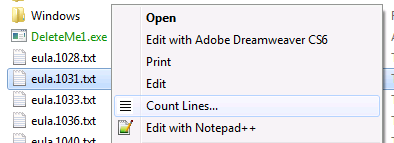
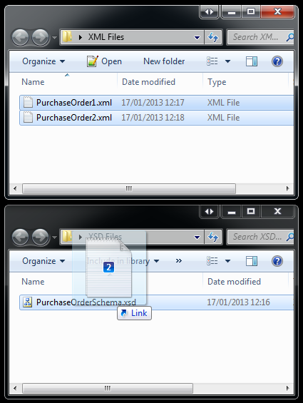
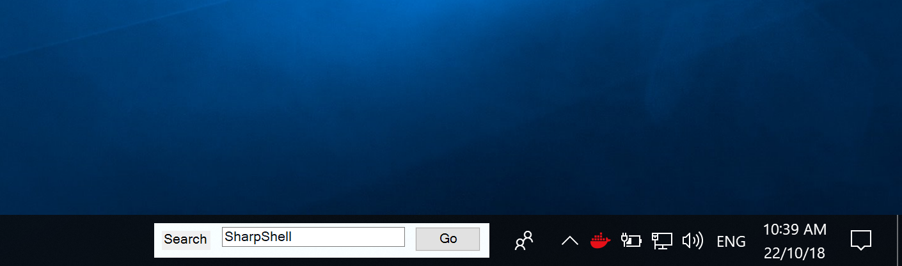
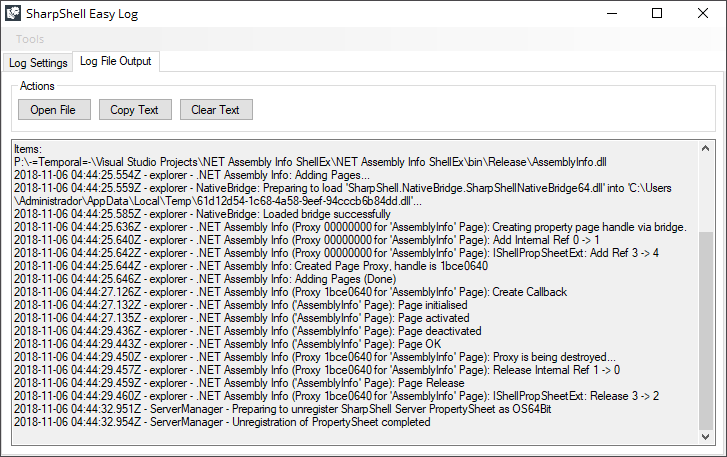

# SharpShell

[](https://ci.appveyor.com/project/dwmkerr/sharpshell/branch/master) [](https://codecov.io/gh/dwmkerr/sharpshell) [](https://www.nuget.org/packages/SharpShell/) [](https://www.guardrails.io)

SharpShell makes it easy to create Windows Shell Extensions using the .NET Framework.

<!-- vim-markdown-toc GFM -->

* [Installation](#installation)
* [User Guide](#user-guide)
* [Supported Shell Extensions](#supported-shell-extensions)
    * [Shell Context Menus](#shell-context-menus)
    * [Icon Handlers](#icon-handlers)
    * [Info Tip Handlers](#info-tip-handlers)
    * [Drop Handlers](#drop-handlers)
    * [Preview Handlers](#preview-handlers)
    * [Icon Overlay Handlers](#icon-overlay-handlers)
    * [Thumbnail Handlers](#thumbnail-handlers)
    * [Property Sheet Extensions](#property-sheet-extensions)
    * [Desk Band Extensions](#desk-band-extensions)
* [Developer Guide](#developer-guide)
    * [Building & Testing](#building--testing)
    * [Enabling Logging](#enabling-logging)
    * [CI/CD](#cicd)
    * [Creating a Release](#creating-a-release)
* [Contributor Guide](#contributor-guide)
* [Testimonials](#testimonials)
* [Projects that use SharpShell](#projects-that-use-sharpshell)
* [Thanks](#thanks)
* [License](#license)

<!-- vim-markdown-toc -->

## Installation

Install SharpShell by searching for 'SharpShell' in the NuGet package manager, or using the Package Manager Console:

```
PM > Install-Package SharpShell
```

The latest official packages are listed below:

| Component                   | Package                                                                                                                                                              |
|-----------------------------|----------------------------------------------------------------------------------------------------------------------------------------------------------------------|
| `SharpShell`                | [](https://www.nuget.org/packages/SharpShell)                                              |
| `ServerRegistrationManager` | [](https://www.nuget.org/packages/ServerRegistrationManager) |

## User Guide

All documentation is being moved to [`docs`](./docs).

Some of the most useful guides are:

- [Deploying SharpShell Servers](./docs/installing/installing.md)
- [Troubleshooting](./docs/troubleshooting.md)

## Supported Shell Extensions

The following extensions are supported by SharpShell.

### Shell Context Menus

Shell Context Menus allow the context menus used in Windows Explorer to be customised.



[Step by Step Tutorial on the CodeProject](http://www.codeproject.com/Articles/512956/NET-Shell-Extensions-Shell-Context-Menus).

### Icon Handlers

Shell Icon Handlers are DLLs that are registered in the system to customise the appearance of icons.


[Step by Step Tutorial on the CodeProject](http://www.codeproject.com/Articles/522665/NET-Shell-Extensions-Shell-Icon-Handlers).

### Info Tip Handlers

Shell Info Tip Handlers are DLLs that are registered in the system to customise tooltips for items in the shell.


[Step by Step Tutorial on the CodeProject](http://www.codeproject.com/Articles/527058/NET-Shell-Extensions-Shell-Info-Tip-Handlers).

### Drop Handlers

Shell Drop  Handlers are DLLs that are registered in the system to extend the drag and drop functionality in the Shell.



[Step by Step Tutorial on the CodeProject](http://www.codeproject.com/Articles/529515/NET-Shell-Extensions-Shell-Drop-Handlers).

### Preview Handlers

Shell PreviewHandlers are dlls that can be registered in the system to allow you to create visually rich previews for items that are displayed directly in Windows Explorer.


[Step by Step Tutorial on the CodeProject](http://www.codeproject.com/Articles/533948/NET-Shell-Extensions-Shell-Preview-Handlers).

### Icon Overlay Handlers

Shell Icon Overlay Handlers can be really useful. They let you display an icon overlay over shell objects to provide extra information. Programs like Dropbox use these overlays to show whether files are synchronised or not.


[Step by Step Tutorial on the CodeProject](http://www.codeproject.com/Articles/545781/NET-Shell-Extensions-Shell-Icon-Overlay-Handlers).

### Thumbnail Handlers

Shell Thumbnail Handlers (or as they're sometimes known, Shell Thumbnail Providers) are COM servers that you can write to customise the appearance of the thumbnail icons in the Windows Shell.


[Step by Step Tutorial on the CodeProject](http://www.codeproject.com/Articles/563114/NET-Shell-Extensions-Shell-Thumbnail-Handlers).

### Property Sheet Extensions

These are extensions that add extra pages to the property sheets shown for shell items such as files, network shares, folders and so on.


[Documentation](./docs/extensions/propertysheetextension/propertysheetextensions.md).

### Desk Band Extensions

These are extensions which add custom functionality to the Windows Desktop or Task Bar.



[Documentation](./docs/extensions/deskband/deskband.md)

## Developer Guide

SharpShell is currently developed in Visual Studio 2017, and can be built using the [Community Edition](https://visualstudio.microsoft.com/vs/community/).

In order to maximize compatibility, we do not use the latest version of each SDK. The following components are needed:

- Windows Universal CRT SDK
- Windows 8.1 SDK
- .NET Core runtime
- Windows Universal C Runtime
- Microsoft Visual Studio 2017 Installer Projects

### Building & Testing

As long as the correct components have be installed for Visual Studio, you should be able to just open the main `./SharpShell/SharpShell.sln` solution to build, test and run any of the code or samples.

You can also use the following scripts to run the processes:

| Script         | Notes                                                                                                                                |
|----------------|--------------------------------------------------------------------------------------------------------------------------------------|
| `config.ps1`   | Ensure your machine can run builds by installing necessary components such as `nunit`. Should only need to be run once.              |
| `build.ps1`    | Build all solutions. Ensures that we build both 32/64 bit versions of native components.                                             |
| `test.ps1`     | Run all tests, including those in samples.                                                                                           |
| `coverage.ps1` | Create a coverage report for the main `SharpShell` project (samples are not included). Reports are written to `./artifacts/coverage` |

These scripts will generate various artifacts which may be useful to review:

```
artifacts\
  \build
    \SharpNativeBridge    # 32/64 bit native binaries for the bridge.
    \SharpShell           # The SharpShell assembly.
  \tests                  # NUnit Test Reportsd
  \coverage               # Coverage Reports
```

Only assemblies and binaries which need to be copied into other projects are added to the `artifacts/build` folder. This makes chaining more complex dependencies manageable. The solution is fairly standard, but be aware that:

1. `SharpShell` depends on `SharpNativeBridge`
2. `SharpNativeBridge` should be built in `x64` mode. When successful, the `x64` build will trigger a `x32` build, and both 32/64 bit binaries are copied to the `artifacts/build/SharpNativeBridge` folder.
3. `SharpShell` copies the latest native bridge binaries to its own `NativeBridge` folder - these are then embedded in the `SharpShell` assembly.
4. The `SharpShell` assembly is copied to `artifacts/build/SharpShell` folder after a successful build.
5. The `SharpShell` assembly is embedded in the `ServerRegistrationManager` binary. The assembly is copied from `artifacts/build/SharpShell` prior to the server registration manager build.

All of the above steps are automated, and will run whether a build is trigger from Visual Studio, the `build.ps1` script or `msbuild`.

### Enabling Logging

A detailed guide explaining how to configure and use logging for SharpShell is at:

[./docs/logging/logging.md](./docs/logging/logging.md)

You can also use the [SharpShell-Easy-Log](https://github.com/ElektroStudios/SharpShell-Easy-Log) tool to quickly enable/disable logging options and view the logs realtime:

[](https://github.com/ElektroStudios/SharpShell-Easy-Log)

The tool is available at: [github.com/ElektroStudios/SharpShell-Easy-Log](https://github.com/ElektroStudios/SharpShell-Easy-Log)

### CI/CD

CI/CD is currently handled by AppVeyor. AppVeyor will:

1. Build the project
2. Run the tests
3. Create the core SharpShell NuGet Package
4. Publish the package to [nuget.org](https://nuget.org) if a version tag is pushed
5. Create a GitHub release with the package if a version tag is pushed

### Creating a Release

To create a release:

1. Update the version number in [`SharedAssemblyInfo.cs`](./SharpShell/SharedAssemblyInfo.cs)
2. Update the [`CHANGELOG.md`](./CHANGELOG.md)
3. Create a new version tag, then push

AppVeyor will build and publish a new NuGet package and as long as a new semver tag is pushed.

## Contributor Guide

The project is maintained by the following group:

| User                                        | Role                         |
|---------------------------------------------|------------------------------|
| [`dwmkerr`](https://github.com/dwmkerr)     | Project creator, maintainer. |
| [`Countryen`](https://github.com/Countryen) | Project maintainer.          |

We have a [Code of Conduct](.github/CODE_OF_CONDUCT.md) aimed at keeping the community welcoming and inclusive.

## Testimonials

If you've used SharpShell and would like to add a testimonial, just send me a message!

> CmisSync, our Dropbox-like client for Enterprise Content Management servers, just switched to SharpShell,
> and we are extremely pleased with this library. Our previous custom-built Windows Explorer integration
> was buggy, unreliable and hard to maintain, and SharpShell is really rock-solid in comparison. The best
> part: It only took 2 days to integrate SharpShell into our software, testing and installer included.
> Thanks SharpShell!

Nicolas Raoul - [CmisSync.com](http://CmisSync.com)

## Projects that use SharpShell

Send me a message to add a project to this list:

 - [Trello Context Menu](https://github.com/GeorgeHahn/TrelloContextMenu)
 - [REAL Shuffle Player 2.0](http://download.cnet.com/Real-Shuffle-Player/3000-2139_4-75992715.html)
 - [The CmisSync context menu](http://aegif-labo.blogspot.jp/2014/08/the-cmissync-context-menu-check-out.html)
 - [TenClips](http://www.paludour.net/TenClips.html)
 - [Checksum Inspector](https://github.com/XxDeadLiiNexX/Checksum-Inspector/#checksum-inspector)
 - [VSIX PowerToys](https://github.com/hmemcpy/VSIXPowerToys)
 - [FileSystemScanner](https://github.com/sensboston/FileSystemScanner)
 - [Windows Explorer Thumbnails for MagicaVoxel .vox files](https://github.com/Arlorean/Voxels)
 - [Markdown Preview](https://github.com/Atrejoe/MarkdownPreview)
 - [SharePoint Shell Extensions by Archon Gnosis](https://sse.technology/)
 - [.NET Assembly Info Shell Extension by ElektroStudios](https://github.com/ElektroStudios/.NET-Assembly-Info-ShellEx)
 - [Modern UI BreadCrumbs WPF Control by Dirkster99](https://github.com/Dirkster99/bm)

## Thanks

Many thanks to [JetBrains](https://www.jetbrains.com/) for providing an Open Source License for their products!


## License

SharpShell is licensed under the MIT License - the details are at [LICENSE.md](https://raw.github.com/dwmkerr/sharpshell/master/LICENSE.md)
