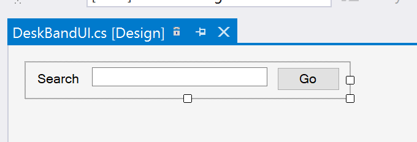
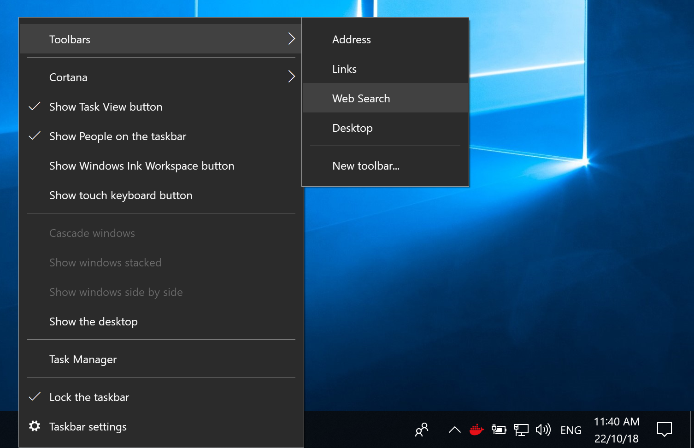

# Desk Band Extensions

Desk Band Extensions are extensions which can run in the Windows Task Bar.


This document describes how to build a simple desk band extension.

Note: Officially, Desk Band extensions are no longer supported as of Windows 7 (see [details here](https://docs.microsoft.com/en-gb/windows/desktop/api/shobjidl/nn-shobjidl-ideskband2)) and [Taskbar Extensions](https://docs.microsoft.com/en-gb/windows/desktop/shell/taskbar-extensions)).

<!-- vim-markdown-toc GFM -->

* [Creating the Project](#creating-the-project)
* [Create the DeskBand Interface](#create-the-deskband-interface)
* [Create the DeskBand Server](#create-the-deskband-server)
* [Install the DeskBand Server](#install-the-deskband-server)
* [See Also](#see-also)

<!-- vim-markdown-toc -->

## Creating the Project

Create a new .NET Class Library project.

Add the following references:

- `System.Windows.Forms`
- `System.Drawing`

Now use the NuGet Package Manager console to add a reference to SharpShell:

```
Install-Package SharpShell
```

For the project to be able to be registered, it will need to have a strong name, which means it will need to be signed. Open the project properties, go to the 'Signing' section and choose 'Sign the Assembly'.

At this stage you have a new class library with the required references and signing setup to build a SharpShell DeskBand Server.

## Create the DeskBand Interface

For this example we will create a simple desk band which offers the user the option to perform a Web Search.

Create a new User Control with the name `DeskBandUI`, add a text box for the search text and a button to run the search command:



The handler for the 'Go' button will browse to the Google Search results for the search text:

```csharp
private void buttonGo_Click(object sender, EventArgs e)
{
    Process.Start("http://google.com#q=" + textBoxSearch.Text);
}
```

## Create the DeskBand Server

You will now need to create a class which derives from `SharpDeskBand`:

```csharp
[ComVisible(true)]
[DisplayName("Web Search")]
public class WebSearchDeskBand : SharpDeskBand
{
    protected override System.Windows.Forms.UserControl CreateDeskBand()
    {
        return new DeskBandUI();
    }

    protected override BandOptions GetBandOptions()
    {
        return new BandOptions
               {
                   HasVariableHeight = false,
                   IsSunken = false,
                   ShowTitle = true,
                   Title = "Web Search",
                   UseBackgroundColour = false,
                   AlwaysShowGripper = true
               };
    }
}
```

The `CreateDeskBand` function will return a new instance of your interface. The `GetBandOptions` function is called by the shell to determine layout and UI options for the server.

The server class itself needs to be visible as COM server, so we use the `ComVisible` attribute.

## Install the DeskBand Server

Follow the [Installing](../../../docs/installing/installing.md) documentation to install the server.

Now restart the `explorer.exe` process. You should see the new desk band listed as a toolbar available to show in the Explorer Task Bar:



The name used in this toolbar is specified by using the `DisplayName` attribute on the server class.


## See Also

- [MSDN: Creating Custom Explorer Bars, Tool Bands, and Desk Bands](https://msdn.microsoft.com/en-us/library/windows/desktop/cc144099(v=vs.85).aspx)
