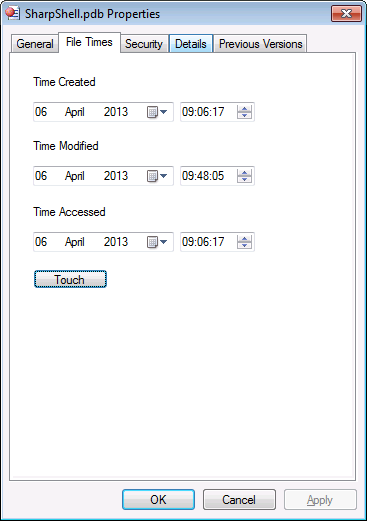

# Property Sheet Extensions

Property Sheet Extensions are Shell Extensions which add additional property sheets to shell objects, such as files, folders or drives.



<!-- vim-markdown-toc GFM -->

* [Creating the Project](#creating-the-project)
* [Create the DeskBand Interface](#create-the-deskband-interface)
* [Create the DeskBand Server](#create-the-deskband-server)
* [Install the DeskBand Server](#install-the-deskband-server)
* [See Also](#see-also)

<!-- vim-markdown-toc -->

## Creating the Project

Create a new .NET Class Library project.

Add the following references:

- `System.Windows.Forms`
- `System.Drawing`

Now use the NuGet Package Manager console to add a reference to SharpShell:

```
Install-Package SharpShell
```

For the project to be able to be registered, it will need to have a strong name, which means it will need to be signed. Open the project properties, go to the 'Signing' section and choose 'Sign the Assembly'.

At this stage you have a new class library with the required references and signing setup to build a SharpShell Property Sheet Extension Server.

## Create the Property Sheet Server

We must have a class that derives from `SharpPropertySheet` - this will be the main extension class.

Create a class named `FileTimesPropertySheet`,  derived from `SharpPropertySheet`:

```csharp
[ComVisible(true)]
[COMServerAssociation(AssociationType.AllFiles)]
public class FileTimesPropertySheet : SharpPropertySheet
{
  protected override bool CanShowSheet()
  {
    //  We will only show the resources pages if we have ONE file selected.
    return SelectedItemPaths.Count() == 1;
  }

  protected override IEnumerable<SharpPropertyPage> CreatePages()
  {
    //  Create the property sheet page.
    var page = new FileTimesPropertyPage();

    //  Return the pages we've created.
    return new[] {page};
  }
}
```

The two key functions are `CanShowSheet` and `CreatePages`.

**CanShowSheet**

This function returns a bool. If the result is true, then the property sheet pages we create are going to be shown, otherwise we won't show them.

**CreatePages**

This function returns a set of SharpPropertyPage objects - these are the actual property pages we're going to add to the shell property sheet.

We also use the `COMServerAssociation` class to associate with a specific shell object. You can find out more in the [`COMServerAssociation` documentation](./docs/com-server-associations.md).

The server class itself needs to be visible as COM server, so we use the `ComVisible` attribute.

## Create the Property Page

You can follow this step as many times as you need - one property sheet extension can add any number of pages.

First, add a `UserControl` to your class library, call it `FileTimesPropertyPage`. Now open up the code-behind for the control and change the parent class from `UserControl` to `SharpPropertyPage`:

```csharp
public partial class FileTimesPropertyPage : SharpPropertyPage
{
    public FileTimesPropertyPage()
    {
        InitializeComponent();

        //  Set the page title.
        PageTitle = "File Times";
    }

    protected override void OnPropertyPageInitialised(SharpPropertySheet parent)
    {
        //  Store the file path.
        filePath = parent.SelectedItemPaths.First();

        //  Load the file times into the dialog.
        LoadFileTimes();
    }

    protected override void OnPropertySheetApply()
    {
        //  Save the changes.
        SaveFileTimes();
    }

    protected override void OnPropertySheetOK()
    {
        //  Save the changes.
        SaveFileTimes();
    }

    private void LoadFileTimes()
    {
        // ...
    }

    private void SaveFileTimes()
    {
        // ...
    }

    private string filePath;
}
```

The full implementation is in the [`Samples`](./SharpShell/Samples) folder. Note that there are set of virtual functions available to allow you to handle property sheet specific events, such as 'Apply', 'Cancel', etc.

| Function | Usage |
|----------|-------|
| `OnPropertyPageInitialised` |	Called when the page must be initialised. |
| `OnPropertyPageSetActive` |  	Called when the page is about to be presented to the user. This is always called  after `OnPropertyPageInitialised` |.
| `OnPropertyPageKillActive` | 	Called when the page is  about to be deselected. |
| `OnPropertySheetApply` | 	Called when the Apply button is pressed. |
| `OnPropertySheetOK` | 	Called when the OK button is pressed. |
| `OnPropertySheetCancel` | 	Called when the Cancel button is pressed. |
| `OnPropertySheetClose` | 	Called when the cross at the top right of the dialog is pressed. |
| `SetPageDataChanged` | 	Call this function to enable the 'Apply' button. |

## Install the Server

Follow the [Installing](./docs/installing/installing.md) documentation to install the server.

Now restart the `explorer.exe` process. If you right click on a file, you'll have the new property sheet available in the file properties.

## See Also

- [MSDN: Property Sheet Extensions](https://msdn.microsoft.com/en-us/library/ms692751.aspx)
- [Step by Step Tutorial on the CodeProject](http://www.codeproject.com/Articles/573392/NET-Shell-Extensions-Shell-Property-Sheets).
