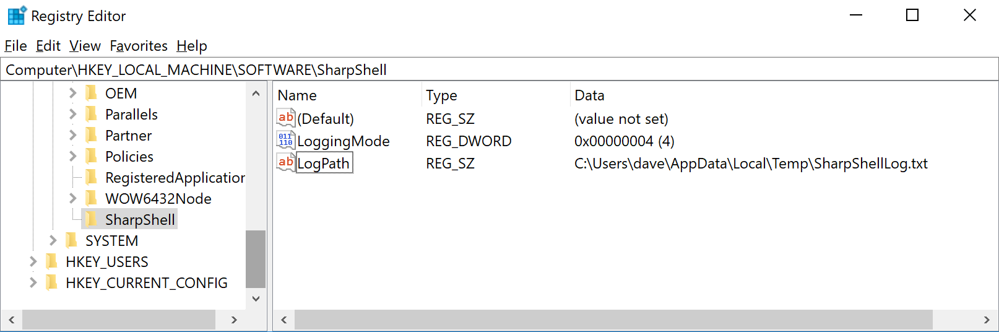
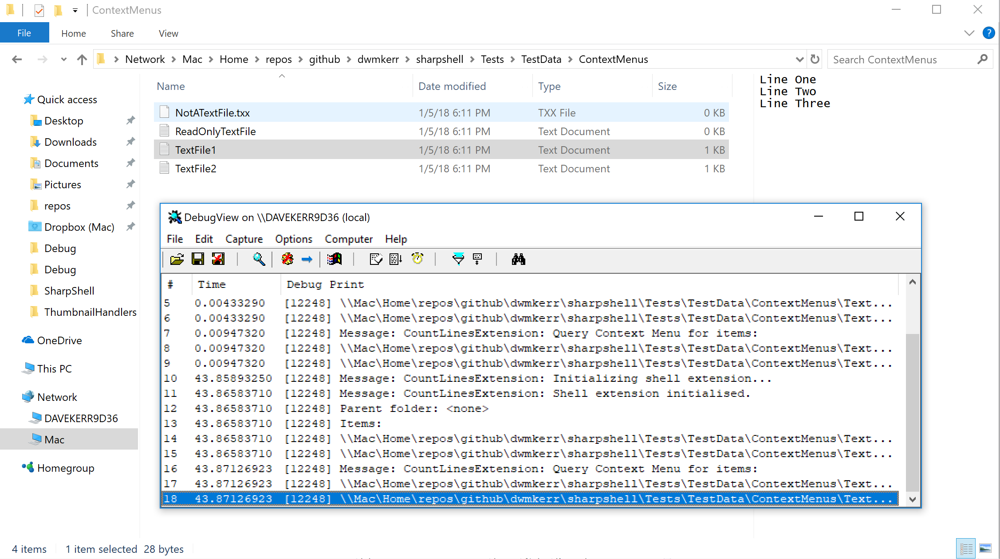
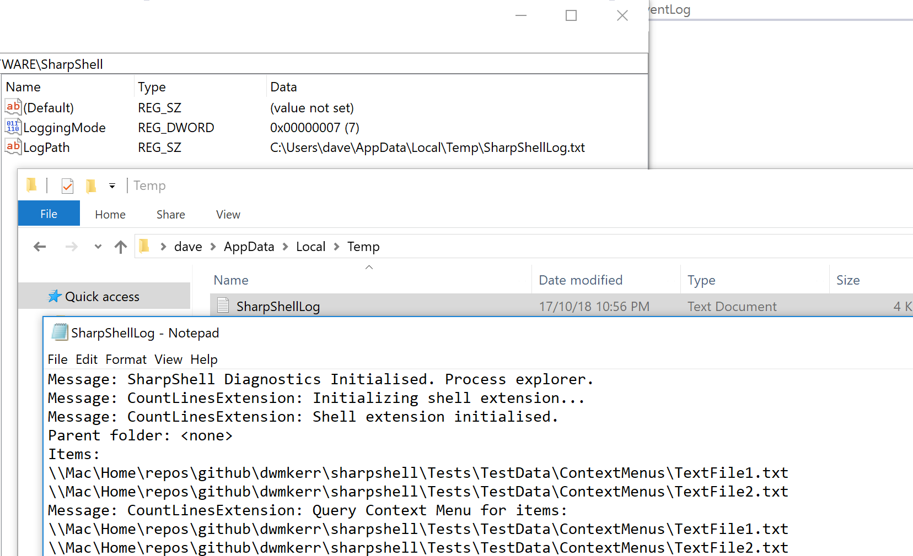

# Logging

By default, SharpShell servers will *not* log any information. This is by design, to ensure that attempting to access resource such as the file system does not slow down the shell.

However, SharpShell *does* support a rich set of logging feature. This guide describes the logging options enabled.

Note: You can use the [SharpShell-Easy-Log](https://github.com/ElektroStudios/SharpShell-Easy-Log) tool to quickly enable/disable logging options and view the logs realtime.

## Configuring Logging

All logging options are controlled by the registry key below:

```
HKEY_LOCAL_MACHINE\Software\SharpShell
```

The following options are available.

| Value Name    | Value Type | Notes                                                               |
|---------------|------------|---------------------------------------------------------------------|
| `LoggingMode` | `DWORD`    | Any combination of the 'Logging Modes' below.                       |
| `LogPath`     | `String`   | The path to save the log file to, if the File logging mode is used. |

The logging mode can be any combination of the following values.

| Value | Output            |
|-------|-------------------|
| `1`   | Debug             |
| `2`   | Windows Event Log |
| `4`   | File              |

The screenshot below shows how logging to a file in the `%TEMP%` can be enabled:



Note that log settings are read on server startup. In practice this means that if you are changing these settings for an installed server which is already running, you will normally need to restart the `explorer.exe` process.

## Debug Output

With this option enabled, SharpShell will write all log messages via the Win32 [`OutputDebugString`](https://msdn.microsoft.com/en-us/library/windows/desktop/aa363362(v=vs.85).aspx) API. This means that any trace listener can be used to view log output.

For example, the screenshot below shows the [`DebugView`](https://docs.microsoft.com/en-us/sysinternals/downloads/debugview) application being used to trace output from a Context Menu extension:



Debug output is highly performant, and should probably be considered to be the safest way to monitor logs from SharpShell servers.

Note: If you already have a trace listener running, such as the debugger in Visual Studio, it will likely capture the trace output and show it before DebugView can.

## Windows Event Log Output

With this option enabled, SharpShell will write all log messages to an Application Event Log named `SharpShell`.

Note: This feature is currently _not_ working at the time of writing, Issue [#190](https://github.com/dwmkerr/sharpshell/issues/190) tracks this.

## File Output

With this option enabled, SharpShell will log to the file at the path specified in the `LogPath` value.

The screenshot below shows an example of this:



Note: If the extension host does not have permissions to access the file, this could fail. Contention when trying to access a write-lock for the file could impact performance. If possible, the Debug Output option should be preferred.

## Developer Guide

Logging Configuration is loaded via the `SystemConfigurationProvider` class. Logging functionality is provided via the `Logging` class.

You can call logging methods explicitly, as below:

```csharp
Logging.Log("Message from SharpShell");
Logging.Error("Uh-oh", new Exception());
```

Some classes have helper functions which allow write to the log, but provide the Server Name or other useful information. Always check for a 
`Log` or `LogError` method before using the generic methods above. The following functions are available:

| Function                     | Notes                                                                                           |
|------------------------------|-------------------------------------------------------------------------------------------------|
| `SharpShellServer.Log`       | Logs a message, automatically including the server display name.                                |
| `SharpShellServer.LogError`  | Logs an error, automatically including the server display name.                                 |
| `SharpPropertyPage.Log`      | Logs a message, automatically including the server display name and property page display name. |
| `SharpPropertyPage.LogError` | Logs an error, automatically including the server display name and property page display name.  |

When available, the functions above (or equivalents) should be preferred as they will add more context to the log messages. A number of the lower level classes used internally (such as the `NativeBridge` and `PropertyPageProxy`) also have these logging helper functions.

## Appendix: Why Not log4net?

A fair question would be "why build a custom logging system, when robust logging libraries like log4net exist?".

The main reason is that Shell Extensions are not like applications or application servers which would normally be the users of a standard logging library. Shell Extensions are hosted in the `explorer` process and fairly deeply embedded into the shell, making what would often be simple tasks, such as reading a config file or accessing other libraries, more challenging.

For this reason, the preferred approach for logging is to use the Debug Output logger, which will use the low level `OutputDebugString` function. This mechanism is tried-and-tested for lower level Windows services, as well as the kernel.
